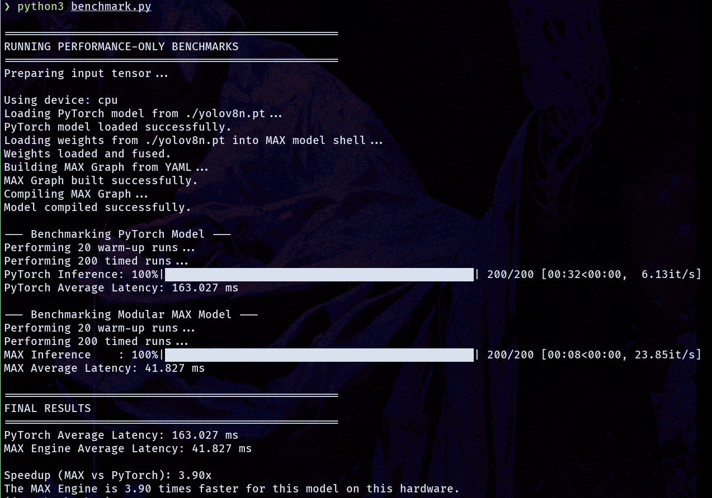

# YOLOv8 Performance Benchmark: PyTorch vs. Modular MAX

This project provides a direct performance comparison between a standard PyTorch implementation of YOLOv8n and an optimized version compiled with the Modular MAX Engine. The goal is to quantify the speedup achieved through ahead-of-time (AOT) compilation and hardware-specific optimizations.

The benchmark measures the core inference latency (in milliseconds) of each model, isolating the forward pass from pre- and post-processing to ensure a fair comparison.

---

## Prerequisites

- **Pixi**: This project uses Pixi for environment and package management. Follow the official instructions to install it on your system.
- **Modular MAX SDK**: You must have the Modular MAX SDK installed. You can get access by signing up at the [Modular website](https://www.modular.com/).
- **Hardware**: A machine with a compatible CPU. If you have a supported GPU (NVIDIA), the PyTorch benchmark will use it automatically. The MAX Engine will target the device it is configured for (CPU or Modular's accelerator).

---

## Setup Instructions

### 1. Clone the Repository

```bash
git clone https://github.com/kzorif/june-hackathon.git
cd june-hackathon 
```

### 2. Initialize the Pixi Environment

This project requires several PyPI dependencies. We will use Pixi to create an isolated environment and install them.

```bash
# Initialize a new Pixi project (if you haven't already)

# Add Python and the required libraries
pixi add --pypi "opencv-python>=4.11.0.86,<5"
pixi add --pypi "torchvision>=0.22.1,<0.23"
pixi add --pypi "pyyaml"
pixi add --pypi "tqdm"
pixi add --pypi "numpy"
pixi add --pypi "ultralytics>=8.3.160,<9"
```

After running these commands, Pixi will create a `pixi.toml` file and install the packages into a local environment.

### 3. Download the Model Weights

The benchmark requires the pre-trained `yolov8n.pt` weights file. Model is provided with the repo


Make sure the `yolov8n.pt` file is in the root directory of the project.

---

## Running the Benchmark

### 1. Activate the Pixi Shell

```bash
pixi shell
```

Your terminal prompt should now indicate that you are inside the Pixi environment.

### 2. Run the Benchmark Script

```bash
# For a performance-only benchmark
python benchmark.py

# No benchmark for accuracy is provided, refer to this post for more details.
```

The script will:

- Load the PyTorch model and prepare it for inference.
- Load the model definition into the MAX framework, fuse weights, and compile it with the MAX Engine.
- Run a series of warm-up and timed inference calls for both models.
- Print the average latency for each and calculate the final speedup factor.

---

## Expected Output


> **Note**: Your actual latency and speedup results will vary depending on your specific hardware.
